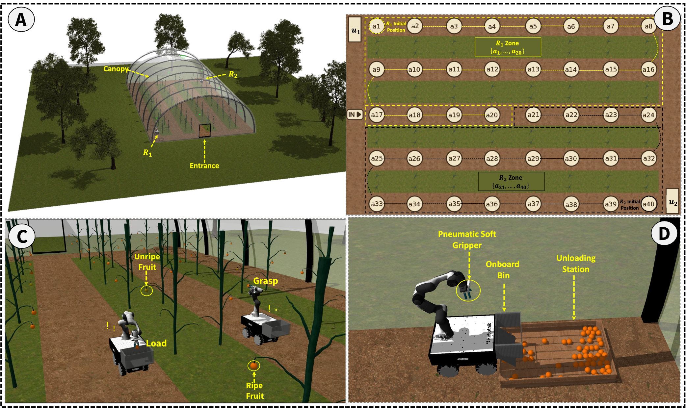
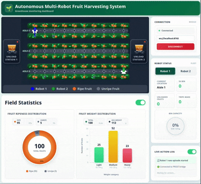

# HARBOT Greenhouse Models

Greenhouse models, simulation environments, and demonstration media developed for:

**HARBOT: Uncertainty-Aware Multi-Robot Task Planning and Execution for Greenhouse Fruit Harvesting**

The repository provides reusable greenhouse and crop assets for **Gazebo Classic**, **Gazebo Sim**, and **PyBullet**, together with demonstrations of the HARBOT planning–execution pipeline.

## Overview



The HARBOT architecture connects empirically grounded grasp uncertainty, RDDL/PROST task planning, planner–execution middleware, and simulation or real-robot execution through a closed task-level feedback loop.

## Demonstrations

### Simulation System Overview

This edited demonstration shows how HARBOT converts high-level RDDL/PROST decisions into closed-loop multi-robot execution in Gazebo. It highlights:

- Independent planning and execution sessions for two robots.
- symbolic action dispatch through the planner–execution middleware.
- Path-based navigation and shared-region collision avoidance.
- RGB-D fruit detection and coordinate-frame transformation.
- Collision-aware arm motion planning with MoveIt.
- Probabilistic grasp outcomes, loading, unloading, and task-state feedback.


**[Watch the full simulation system overview](https://www.dropbox.com/scl/fi/a84vjmc8g44aoa231ryps/harbot_simulation_features.mp4?rlkey=xneqs1onafdokjcb1fav9ost0&raw=1)**

### Accelerated Full-Mission Simulation

This video shows a complete two-robot greenhouse mission at increased playback speed. The robots execute asynchronous RDDL/PROST action streams to navigate between waypoints, harvest ripe fruit, load their onboard containers, return to unloading stations, and complete the assigned task.


**[Watch the accelerated full-mission run](https://www.dropbox.com/scl/fi/8u0w9vq324wa6iw6s6tmx/harbot_simulation_full_run.mp4?rlkey=znz77gplb1lpxz9gqqgm8yybk&raw=1)**

### Real-Robot Closed-Loop Demonstration

This demonstration shows the HARBOT planning–execution pipeline operating on the physical RB-KAIROS mobile manipulator. The platform combines a Franka Emika Panda arm, an eye-in-hand RGB-D camera, and a pneumatic soft gripper to execute planner-generated navigation, grasping, loading, and unloading actions with physical outcome feedback.


**[Watch the full real-robot demonstration](https://www.dropbox.com/scl/fi/0g0rpgrh00qdp91bk10hw/harbot_real_robot_demo.mp4?rlkey=xm345wtel49c81polh473mnw2&raw=1)**

### Task-Level Monitoring Dashboard

The browser-based monitoring interface visualizes the high-level RDDL/PROST action trace and task progress, including robot locations, fruit states, bin contents, unloading trips, payload utilization, and greenhouse-level statistics.



**[Watch the full monitoring dashboard demo](https://www.dropbox.com/scl/fi/o6fkgn3ihllf1l7yktnsn/HARBOT-Task-Monitoring-Dashboard-Demo.mp4?rlkey=56ay5jxxg35rok242hh508seb&raw=1)**

## Supported Simulation Environments

### Gazebo Classic


Use this version with Gazebo Classic, for example Gazebo 11.

From the repository root, add the model directory to `GAZEBO_MODEL_PATH`:

```bash
export GAZEBO_MODEL_PATH="${GAZEBO_MODEL_PATH}:$(pwd)/gazebo_classic/models"
```

Launch the greenhouse world:

```bash
gazebo gazebo_classic/greenhouse.world
```

If Gazebo hangs while attempting to download external models, disable online model fetching:

```bash
export GAZEBO_MODEL_DATABASE_URI=""
```

> **Note:**
> To use the greenhouse environment in another simulation workspace, copy the `gazebo_classic/` directory into the workspace. The models include the required meshes and textures.

### Gazebo Sim


Use this version with newer Gazebo releases, including Ignition Gazebo and Gazebo Sim distributions such as Fortress, Garden, and Harmonic.

From the repository root, configure the resource path:

```bash
export GZ_SIM_RESOURCE_PATH="${GZ_SIM_RESOURCE_PATH}:$(pwd)"
```

Launch the greenhouse world:

```bash
gz sim gazebo_sim/greenhouse_world.sdf
```

> **Note:**
> To use the greenhouse environment in another simulation workspace, copy the `assets/` and `gazebo_sim/` directories into the workspace.

### PyBullet


Install PyBullet:

```bash
pip install pybullet
```

Run the greenhouse simulation:

```bash
python pybullet/load_greenhouse.py
```

> **Note:**
> To use the greenhouse environment in another workspace, copy the `assets/` directory and use the loading script provided in the `pybullet/` directory.
